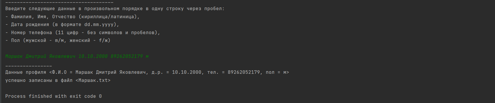
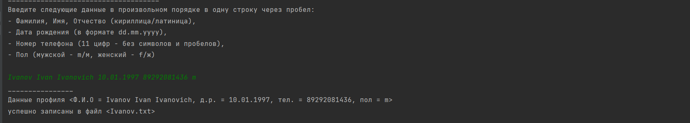
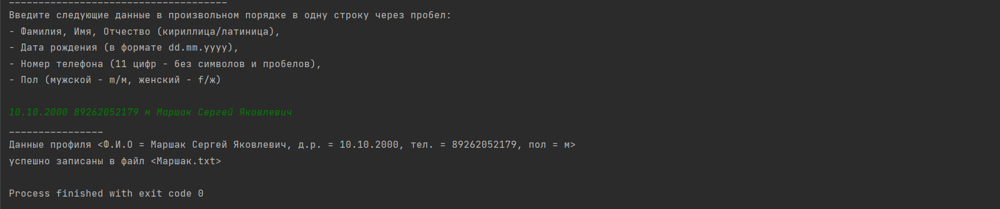
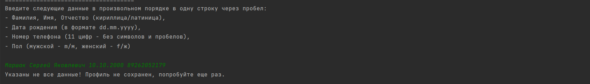
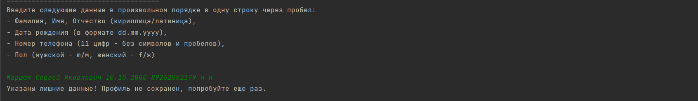
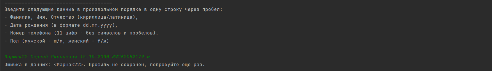
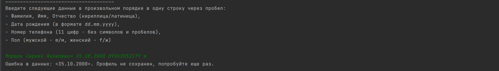
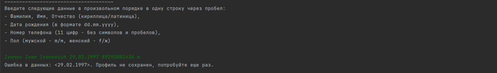
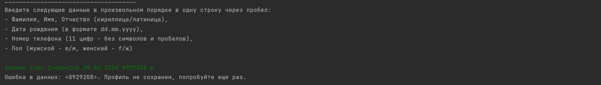
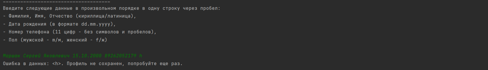

# Продвинутая работа с исключениями в Java
## Задание
Напишите приложение, которое будет запрашивать у пользователя следующие данные в произвольном порядке,
разделенные пробелом:
Фамилия Имя Отчество датарождения номертелефона пол

Форматы данных:
фамилия, имя, отчество - строки
дата_рождения - строка формата dd.mm.yyyy
номер_телефона - целое беззнаковое число без форматирования
пол - символ латиницей f или m.

Приложение должно проверить введенные данные по количеству. Если количество не совпадает с требуемым,
вернуть код ошибки, обработать его и показать пользователю сообщение, что он ввел меньше и больше данных, чем требуется.
Приложение должно попытаться распарсить полученные значения и выделить из них требуемые параметры. Если форматы
данных не совпадают, нужно бросить исключение, соответствующее типу проблемы. Можно использовать встроенные типы java
и создать свои. Исключение должно быть корректно обработано, пользователю выведено сообщение с информацией,
что именно неверно.
Если всё введено и обработано верно, должен создаться файл с названием, равным фамилии, в него в одну строку
должны записаться полученные данные, вида

    <Фамилия><Имя><Отчество><датарождения> <номертелефона><пол>

Однофамильцы должны записаться в один и тот же файл, в отдельные строки.
Не забудьте закрыть соединение с файлом.
При возникновении проблемы с чтением-записью в файл, исключение должно быть корректно обработано, пользователь
должен увидеть стектрейс ошибки.
---------------------------------------------------------------------------------------------------------------------

# Демонстрация решения:

## Данные, записанные в файл

## Успешная запись (кириллица/латиница)

## Успешная запись данных, введенных в произвольном порядке

## Обработка введенных данных по количеству

## Обработка Ф.И.О.

## Обработка даты рождения

## Обработка номера телефона

## Обработка пола

